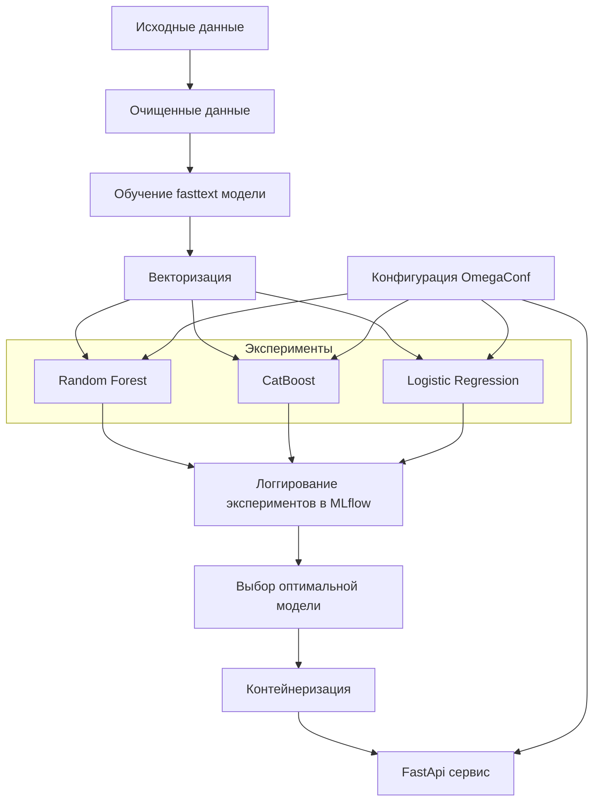

# mlops курсовая

Проект классифицирует русскоязычные отзывы на три класса: Положительный, Нейтральный, Отрицательный.  
Реализован полный ML-пайплайн с обучением моделей, инференс-сервисом на FastAPI и Streamlit UI.

---

## Pipeline



## Быстрый старт

### 1.Клонирование и настройка окружения

##### Клонировать репозиторий

```bash
git clone <repository-url>
cd mlops-coursework
```

##### Создать виртуальное окружение

```bash
python -m venv venv
```

##### Активировать (Linux/macOS)

```bash
source venv/bin/activate
```

##### Активировать (Windows)

```bash
venv\Scripts\activate
```

##### Установить зависимости

```bash
pip install -r requirements.txt
```

### 2. Эксперименты

##### Запуск экспериментов

```bash
python src/experiments.py

```

### MLflow UI

##### Отслеживания экспериментов

```bash
mlflow ui --port 5000
```

Открыть: http://127.0.0.1:5000/

### Локальный запуск FastAPI сервиса

```bash
uvicorn api.main:app --host 0.0.0.0 --port 8000 --reload
```

Эндпоинты:

- /health — проверка состояния сервиса
- /predict — предсказание сентимента

### Streamlit UI

#### Команда для запуска streamlit

```bash
streamlit run ui/streamlit_ui.py
```

### Контейнеризация

##### Сборка образа

```bash
docker build -t nlp-sentiment-inference .
```

##### Запуск контейнера

```bash
docker run -p 8000:8000 nlp-sentiment-inference
```
